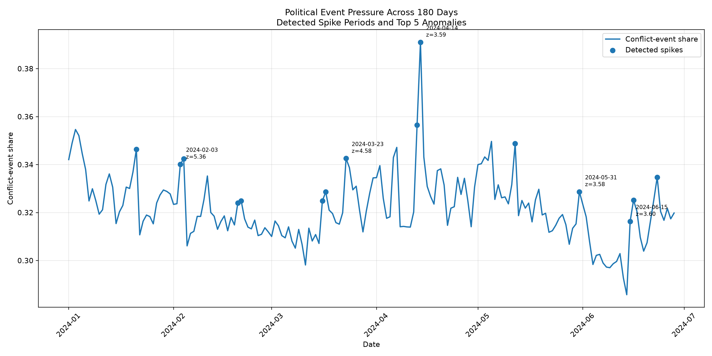

# Political Information Pressure

A reproducible computational social-science project examining temporal spikes and persistence in global conflict-event activity using GDELT event data.

## Research question

**Do periods of unusually elevated global conflict-event activity exhibit detectable anomalies and short-term temporal persistence?**

## Motivation

Research on misinformation often focuses on the accuracy or persuasive effect of individual messages. This project explores a complementary dimension: whether the **volume, velocity, and temporal concentration of information** can be measured as an environmental condition relevant to political communication and information overload.

The project operationalizes **political event pressure** as the relative concentration of conflict-coded events within the broader global event environment.

It does not treat news volume as direct evidence of cognitive overload. Instead, it constructs a reproducible environmental indicator that could later be paired with individual-level experimental or survey outcomes.

A possible theoretical pathway is:

**information pressure → cognitive load → heuristic processing → political effects**

## Data

The analysis uses the **GDELT Event Database**, drawing on daily event files covering 180 consecutive days from January to June 2024.

Each daily file contains structured event records with variables describing actors, locations, event types, and the **Goldstein Scale**, which measures the cooperative or conflictual character of an event.

For this project, events with a negative Goldstein score are treated as conflict-coded events. The main daily measure is the share of all recorded events that are conflict-coded.

This produces a normalized indicator of **political event pressure** rather than a raw event count.

## Methods

The workflow demonstrates:

- automated retrieval of daily GDELT event files
- tabular event-data parsing and cleaning
- pandas data cleaning
- normalized time-series construction
- rolling means and standard deviations
- z-score spike detection
- lagged OLS regression
- Augmented Dickey-Fuller stationarity testing
- matplotlib visualization
- reproducible project organization

## Main measure

### Conflict-event share

The main information-pressure measure is:

```text
conflict-coded events
---------------------
all GDELT events
```
Conflict-coded events are defined as events with a negative GDELT Goldstein Scale value (GoldsteinScale < 0).

This normalization avoids interpreting raw event volume alone as heightened political event pressure.

## Spike detection

Each observation is compared with a lagged rolling baseline.

Approximate interpretation of the rolling z-score:

- `z ≈ 0` — typical relative to the recent baseline
- `z ≈ 1` — elevated
- `z ≥ 2` — unusually high
- `z ≥ 3` — highly unusual

The default project threshold classifies `z ≥ 2` as an information-pressure spike.

## Results

The final analysis covered **180 daily observations** and identified **15 periods of unusually elevated political event pressure** using a rolling z-score threshold of `z >= 2`.

A lagged OLS model showed substantial short-term persistence in conflict-event pressure:

- Lag-1 coefficient: **β = 0.692**
- p-value: **p < 0.001**
- Augmented Dickey-Fuller p-value: **0.0418**

The ADF result rejects a unit-root null at the 5% level, providing support for stationarity in this exploratory specification.

The highest-pressure periods included several major geopolitical episodes. Actor-country decomposition of the leading spike showed the largest identifiable shares associated with:

USA: 29.6%
Israel: 6.5%
Iran: 4.9%
Palestine: 4.6%
Iraq: 4.1%

These results suggest that political event pressure exhibits meaningful short-term persistence and that unusually high-pressure periods can be detected computationally.

The results should not be interpreted as evidence that event volume itself causes cognitive overload. The project instead constructs a macro-level indicator of political information pressure that could later be paired with individual-level measures of attention, recall, trust, heuristic reasoning, or misinformation susceptibility.

### 180-day event-pressure timeline



## Temporal persistence

A lagged OLS model estimates:

```text
information pressure today
=
constant
+ β × information pressure in the previous period
+ error
```

A positive and statistically significant lag coefficient suggests that elevated information pressure tends to persist across adjacent periods.

## Stationarity

An Augmented Dickey-Fuller test is included as a diagnostic for whether the series behaves as a stationary process.

This is relevant because regression relationships in trending time series can otherwise be misleading.

## Project structure

```text
political-information-pressure/
├── README.md
├── HOW_TO_INTERPRET.md
├── requirements.txt
├── config.json
├── src/
│   └── analysis.py
├── data/
├── results/
└── figures/
```

## Reproducibility

Create a virtual environment and install dependencies:

```bash
python -m venv .venv
```

Windows:

```bash
.venv\Scripts\python.exe -m pip install -r requirements.txt
```

macOS/Linux:

```bash
source .venv/bin/activate
pip install -r requirements.txt
```

Run the analysis:

```bash
python src/analysis.py
```

On Windows without PowerShell script activation:

```bash
.venv\Scripts\python.exe src\analysis.py
```

## Outputs

The script produces:

- `data/gdelt_event_pressure.csv`
- `results/processed_event_pressure.csv`
- `results/spike_days.csv`
- `results/model_summary.txt`
- `results/spike_contributors_<date>.csv`
- `figures/event_pressure_timeseries.png`
- `figures/rolling_zscore.png`
- `figures/lag_persistence.png`
- `figures/political_event_pressure_180d_annotated.png`
- `figures/spike_contributors_<date>.png`

## Limitations

This project is exploratory and observational.

It does not establish that information pressure causes cognitive overload or political effects. News volume is only one dimension of the broader information environment, and keyword-based retrieval can contain both false positives and false negatives.

A stronger follow-up design could combine environmental information-pressure measures with individual-level outcomes such as:

- recall
- political trust
- misinformation recognition
- decision confidence
- response time
- heuristic reasoning
- political attitudes

## Research relevance

The project is designed as a small computational extension of broader research on:

- digital influence operations
- political communication
- information overload
- political cognition
- misinformation
- cognitive resilience
- computational social science
